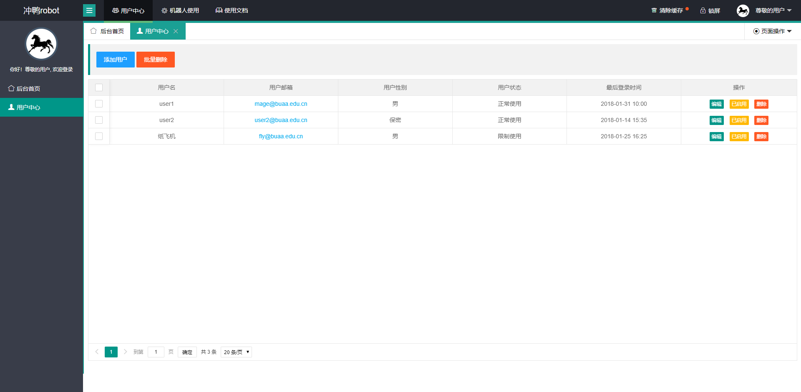
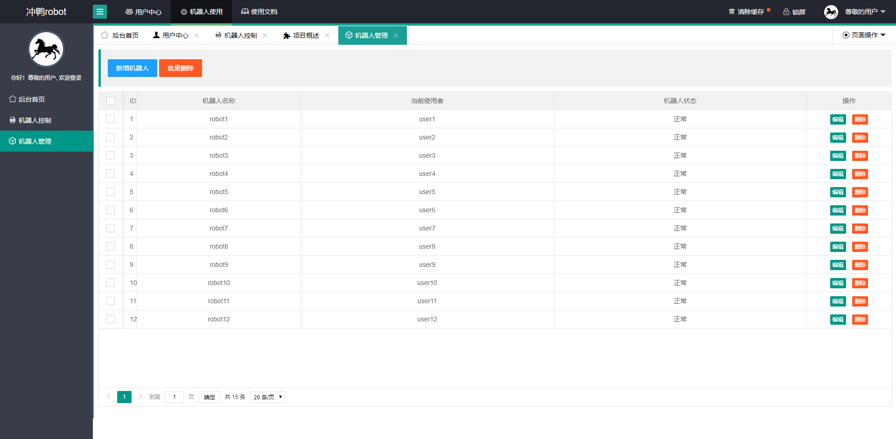
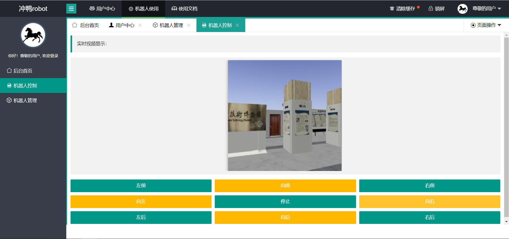
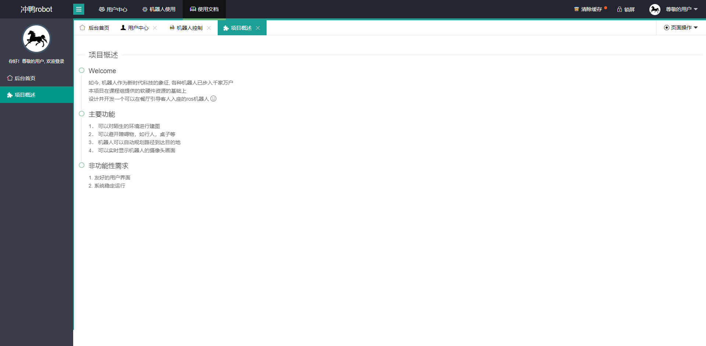

# 餐厅管理机器人Web端说明文档

## 一、项目说明

如今, 机器人作为新时代科技的象征, 各种机器人已步入千家万户
本项目在课程组提供的软硬件资源的基础上
设计并开发一个可以在餐厅引导客人入座的ros机器人 

主要功能
1． 可以对陌生的环境进行建图
2． 可以避开障碍物，如行人，桌子等
3． 机器人可以自动规划路径到达目的地
4． 可以实时显示机器人的摄像头画面

非功能性需求
1. 友好的用户界面
2. 系统稳定运行

## 二、数据库设计

| **数据表名**           | 属性名      | 属性类型     |
| ---------------------- | ----------- | ------------ |
| **用户（包含管理员）** | 用户id      | Int(16) KEY  |
| 用户名                 | Char(32)    |              |
| 密码                   | Char(64)    |              |
| 用户权限               | Int(16)     |              |
| **机器人**             | 机器人id    | Int(16) KEY  |
| 机器人状态             | Int(16)     |              |
| Ip地址                 | Int(16)     |              |
| Mac地址                | Int(16)     |              |
| 当前所在地图id         | Int(16)     |              |
| 当前用户id             | Int(16)     |              |
| 当前位置横坐标         | Int(16)     |              |
| 当前位置纵坐标         | Int(16)     |              |
| **地图**               | 地图id      | Int(16) KEY  |
| 地图名称               | Char(32)    |              |
| 地图描述               | Char(64)    |              |
| **用户管理**           | 用户权限    | Int(16)  KEY |
| 用户管理操作           | Int(16) KEY |              |
| **机器人管理**         | 用户权限    | Int(16) KEY  |
| 机器人管理操作         | Int(16) KEY |              |
| **日志信息**           | 机器人id    | Int(16) KEY  |
| 日志时间               | Char(16)    |              |
| 日志信息               | Char(512)   |              |

## 二、功能说明

本设计采用spring boot+layui框架，数据库使用mysql8.0.20.

主要分为以下几个界面：

#### 1、用户管理界面

#### 2、机器人管理界面

#### 3、机器人直接控制界面

#### 4、项目概述界面

